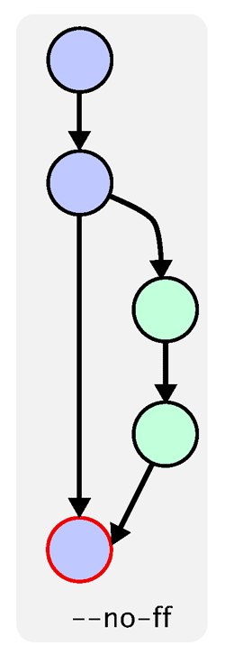

# Git版本控制相关规范

> 为什么要使用Git相关的规范?

首先为什么要用Git? 就是因为Git有版本的分支(branch)和合并(merge)功能。有些传统的版本管理软件, 分支操作实际上会生成一份现有代码的物理拷贝, 而Git只生成一个纸箱当前版本(又称`快照`)的指针, 因此非常快捷易用。

但是太方便也会产生副作用。如果不加注意, 很可能会留下一个分支很多, 四处开放的版本库, 到处都是分支, 完全看不出主干发展的脉络。

所以需要提出一个分支管理的规范和使用的规范, 才能使项目的版本管理更加简洁, 主干清晰。

### Git分支管理规范

#### 1. 主分支Master

项目中有且只能有一个主分支, 而且默认就是`Master`分支。它是自动建立的, 版本库初始化之后, 默认就是在主分支上进行开发。

**所有提供给用户使用的正式版本, 都是`Master`分支发布**

#### 2. 开发分支Develop

`Master`主分支只用来发布重大版本, 平时程序员开发应该在`Develop`分支上完成。**如果想正式对外发布, 就在`Master`分支上, 对`Develop`分支进行合并`Merge`。(这里要注意合并的顺序)**


Git创建`Develop`分支的命令:

```shell 
git checkout -b develip master 
```

将`Develop`分布发布到`Master`分支的命令:

```shell
# 切换到Master分支
git checkout master

# 对develop分支进行合并
git merge --no-ff develop
```

> 默认情况下, Git执行`快进式合并(fast-farward merge)`, 会直接将`Master`分支指向`Develop`分支。


> 而这里使用`--no-ff`参数表示, 会执行正常合并, 在`Master`分支上生成一个新节点。为了保证版本演进的清晰。



#### 3. 功能分支Feature

这是为了开发某种特定功能, 从`Develop`分支上面分出来的。开发完成后, 要再合并到`Develop`分支中。

`Feature`分支的名字, 可以采用`feature-*`的形式命名。

创建一个功能分支:

```shell
git checkout -b feature-x develop
```

开发完成后, 将`Feature`分支合并到`Develop`分支:

```shell
git checkout develop

git merge --no-ff feature-x
```

合并成功之后需要删除feature分支:

```shell
git branch -d feature-x
```

#### 4. 预发布分支Release

在发布省市版本之前(即合并到`Master`分支之前), 我们需要一个预发布版本进行测试。

`Release`分支是从`Develop`分支上面分出来的, 预发布结束之后, 必须合并到`Develop`和`Master`分支。它的命名可以采用`release-*`的形式。

创建一个预发布分支:

```shell
git checkout -b release-1.2 develop
```

测试完成后没有问题, 合并到`master`分支:

```shell
git checkout master

git merge --no-ff release-1.2

# 对合并生成的新节点, 做一个标签
git tag -a 1.2
```

在合并到`develop`分支:

```shell
git checkout develop

git merge --no-ff release-1.2
```

最后删除`release-*`分支

```shell
git branch -d release-1.2
```

#### 5. 修补bug分支————hotfix分支

项目发布后, 难免会出现bug。这是需要创建一个分支, 进行bug修补。

`hotfix`分支是从`Master`分支上分出来的。修补结束之后, 在合并进`Master`和`Develop`分支。它的命名可以采用`hotfix-*`的形式。

创建一个`hotfix`分支:

```shell
git checkout -b hotfix-0.1 master
```

修补完成之后, 合并到`master`分支

```shell
git checkout master

git merge --no-ff hotfix-0.1

git tag -1 0.1.1
```

在合并到`develop`分支:

```shell
git checkout develop

git merge --no-ff hotfix-0.1
```

最后, 删除`hotfix`分支:

```shell
git branch -d hotfix-0.1
```

### Git使用流程规范

这部分内容结合日常项目的开发流程, 涉及到开发新功能, 分支合并, 发布新版本以及发布紧急修补版本等操作。

#### 1. 切换到develop分支, 更新develop最新代码

```shell
git checkout develop

git pull --rebase
```

#### 2. 新建feature分支, 开发新功能

```shell
git checkout -b feature-xxx

git add <files>

git commit -m "feat(xxx): commit a"

git commit -m "feat(xxx): commit b"

# 其他提交

```
如果此时`develop`分支有一笔提交, 影响到你的`feature`开发, 可以`rebase develop`, 前提是该`feature`分支只有你自己一个在开发, 如果多人都在开发该分支, 需要进行协调:

```shell
# 切换到 develop分支 并更新 develop分支 代码
git checkout develop
git pull --rebase

# 切回 feature分支
git checkout feature-xxx
git rebase develop

# 如果需要提交到远端, 且之前已经提交到远端, 此时需要强推(强退需慎重)
git push --force
```

#### 3. 完成 feature分支, 合并到 develop分支

```shell
# 切到 develop分支, 更新代码
git checkout develop
git pull --rebase

# 合并 feature分支
git merge feature-xxx --no-ff

# 删除 feature分支
git branch -d feature-xxx

# 推到远端
git push origin develop
```

#### 4. 所有 feature分支 均合并到 develop分支 之后, 切出 release分支, 发布新版本, 提交测试并进行bug fix

```shell
# 当前在 develop分支
git checkout -b release-1.0

# 在 release-1.0 分支进行bug fix
git commit -m "fix(xxx): xxxxx"

```

#### 5. 所有bug修复完成, 准备发布新版本

```shell
# master分支 合并 release分支 并添加 tag
git checkout master
git merge --no-ff release-1.0 --no-ff

# 添加版本标记, 这里使用版本号标记
git tag 1.0

# develop分支 合并 release分支
git checkout develop
git merge --no-ff release-1.0

# 删除 release分支
git branch -d release-1.0
```

#### 6. 线上出现bug, 需要紧急发布修改版本

```shell
# 当前在 master分支
git checkout master

# 切出 hotfix 分支
git checkout -b hotfix-1.0

... 进行 bug fix 提交

# master分支 合并 hotfix分支 并添加 tag(紧急版本
git checkout master
git merge --no-ff hotfix-1.0 --no-ff

# 添加版本标记, 这里用版本号
git tag 1.0

# develop 分支合并 hotfix 分支(如果此时存在 release 分支的话，应当合并到 release 分支)
git checkout develop
git merge --no-ff hotfix-1.0

# 删除 hotfix 分支
git branch -d hotfix-1.0
```

### 提交信息规范

git commit 格式如下:

```txt
<type>(<scope>):<subject>
```

针对上面的信息进行说明:

- **type 类型, 提交的类别**

    * **feat**: 新功能
    * **fix**: 修改bug
    * **docs**: 文档变动
    * **style**: 格式调整, 对代码实际运行没有改用, 例如添加空行, 格式化等。
    * **refactor**: bug修复和添加新功能之外的代码改动
    * **pref**: 提升性能的改动
    * **test**: 添加或修改测试代码
    * **chore**: 构建过程或辅助工具和库的更改

- **scope修改范围**

    主要是这次修改涉及到的部分, 简单概括, 例如: login, train-order

- **subject修改的描述**

    具体的修改描述信息

- **示例**

    ```shell
    feat(detail): 详情页修改样式
    fix(login): 登录页面错误处理
    test(list): 列表页面添加测试代码
    ```

**注意事项**:

1. `type + scope`能够控制每笔提交改动的文件尽可能少且集中, 避免一次很多文件改动或者多个改动合成一笔
2. `subject`推荐使用中文, 除非英文水平很好
3. 避免重复提交信息, 如果发现上一次提交没有改完, 可以使用 `git commit --amend`指令追加改动, 尽量避免重复的提交信息

